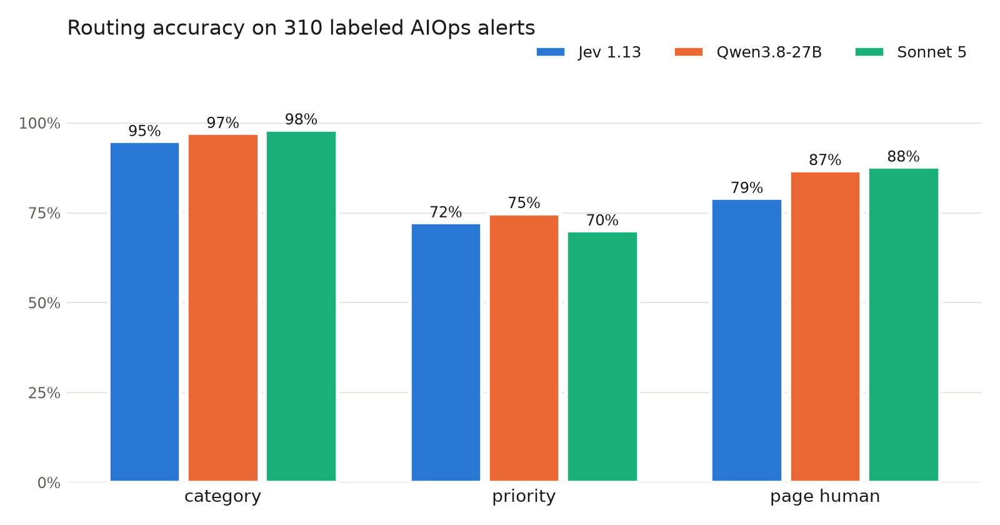
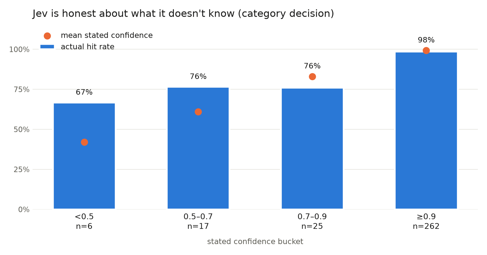

# Testing Jev: can a model that can't talk route my alerts?

*TypeSafe's new "System One" model vs two LLM yardsticks — Qwen3.8-27B and
Claude Sonnet 5 — on 310 labeled AIOps alerts.*

---

Jev can't write a sentence.

That's the whole hook. TypeSafe AI came out of stealth last week with a model
they call a "System One model": it doesn't generate text at all. You send it
state plus typed questions, it sends back probability distributions. Their
pitch is basically "a smart `if` statement" — 70–500ms, $0.042 per million
input tokens, output free, up to 100x faster and 200x cheaper than using an
LLM for the same decision.

Those are launch-week numbers from a launch-week company, and I have a place
where they'd matter: I'm building an autonomous ops platform where a
supervisor agent routes alerts to specialist agents, and every one of those
routing decisions is currently an LLM call. If Jev's claims hold, that's
exactly the layer it should own.

So this whole post is one experiment with one purpose: **put Jev through
realistic alert triage and see if it earns the routing layer.** The LLMs in
the comparison aren't the subject — they're the yardsticks Jev has to measure
up against.

## The experiment

To judge Jev you need a bar to clear, so it runs against two of them — the
router I'd use today and the strongest one money buys:

- **Jev 1.13** via TypeSafe's API — the model under test
- **Qwen3.8-27B** running locally on my M5 Max via LM Studio (the same model
  from my earlier eval episodes) — the practical yardstick
- **Claude Sonnet 5** via OpenRouter, structured outputs — the frontier
  yardstick

The job is L1 triage, mirrored from my AIOps prototype: for each alert, decide
**category** (capacity / availability / performance / security / noise),
**priority** (P1/P2/P3), and **page_human** (yes/no). Every router answers the
same three questions about the same 310 synthetic big-data-platform alerts —
Kafka lag, BQ job failures, cert expiries, flapping hosts — each with a gold
label, and about a quarter of them deliberately sitting on category boundaries,
because boundary cases are where routers earn their keep.

Shadow-mode methodology: nothing acts on any answer, everything gets logged and
scored after. Code and dataset: [repo link].

## First lesson: I benchmarked my own TLS handshakes

My first Jev run measured p50 850ms and I nearly wrote off their latency claims.
Then I looked at a curl timing breakdown: ~300ms TCP round trip to their US
endpoint (I'm in India — physics), plus ~300ms of TLS handshake **on every
call**, because my client opened a fresh connection each time.

One persistent `httpx.Client` later: **p50 331ms**, of which maybe 50–100ms is
actual inference. Their 70–500ms claim holds. Old SRE lesson, new costume:
connection pooling is the difference between claimed and observed latency, and
if your agent framework makes routing calls without a keep-alive client, you're
adding half a second of pure handshake to every hop.

## How Jev measured up

| n=310, same schema | Jev 1.13 | Qwen3.8-27B (local) | Sonnet 5 |
|---|---|---|---|
| category | 95% | 97% | **98%** |
| priority | 72% | **75%** | 70% |
| page_human | 79% | 87% | **88%** |
| latency p50 / max | **331ms / 955ms** | 3.2s / 79s | 4.6s / 9.3s |
| cost per alert | **$0.000023** | $0 marginal | $0.0024 |
| cost per 1M alerts | **~$23** | $0 marginal | ~$2,430 |

Three things jumped out.

**Jev gives up almost nothing to the frontier model.** Sonnet wins category by
3 points and page_human by 9, at 100x Jev's per-alert cost and 14x its latency
— and Jev actually *beats* it on priority. For structured triage decisions,
what you're buying from an LLM is mostly wasted reasoning. (Sonnet's run cost
$0.75 total. Jev's cost $0.0072. The local model cost sixteen minutes of my
Mac's time.)

**Jev is the only one of the three that survives the paging path.** Qwen's
median is a tolerable 3.2s, but its worst case was 79 seconds on one alert —
a router that occasionally takes 79s isn't a router, it's a liability. Jev's
worst case across all 310 alerts: 955ms.

**Priority is hard for everyone — suspiciously so.** 70–75% across three very
different models is less a model ranking than a smell that my P1/P2/P3 gold
labels have ambiguity in them. I'm treating that as a rubric problem to fix, not
a finding to publish. (Caveat repeated below, because it matters.)

## The interesting part: calibration

Accuracy was never really the question — the question is whether Jev **knows
when it doesn't know**, because that's what makes a fast/slow hybrid
architecture work.

On the category decision, Jev put 262 of 310 answers in the ≥0.9 confidence
bucket and was right on 98% of them. Below 0.9, accuracy drops to ~75% — and Jev
*tells you so* by lowering its stated confidence. My favorite single result: a
Dataproc cluster losing workers while the autoscaler recovered them. Jev
classified it correctly at 0.34 confidence — which is exactly the answer you
want from an L1: "here's my guess, but escalate this one."

It's not infallible. Five answers were confidently wrong (≥0.9 confidence,
wrong category) — mostly noise-vs-something boundary cases, like a
known-misconfigured cron's failed logins classified as `security` at 0.99. A
threshold policy alone will never catch those five. Calibration means the
confidence numbers are honest on average, not that any single 0.99 is a
guarantee.

## The architecture that falls out

Gate on confidence: Jev answers everything; below 0.9, escalate to an LLM.

On category, that hybrid hits **97% — matching the LLMs — while escalating only
48 of 310 alerts** (15%). And here's the detail I didn't expect: it scores 97%
*regardless of whether the fallback is local Qwen or Sonnet*, because only the
hard 15% ever reaches the fallback. So the rational stack is Jev + the local
model: ~$23 per million alerts, sub-second median, no external dependency on the
escalation path, and the slow model only wakes up where latency matters least.

That's the Kahneman framing TypeSafe is selling, but with my own numbers
attached: System One handles 85% of decisions in 331ms, System Two gets the
weird 15%.

Where the thesis is weaker: the yes/no `page_human` decision. A naive 0.5
threshold on Jev's probability loses badly to the LLMs (79% vs 87–88%), and
confidence-gating it escalates most of the traffic. Paging is a judgment call
with asymmetric costs — over-paging is annoying, under-paging is an incident —
and I think the fix is asymmetric thresholds rather than a smarter model. That's
the next experiment.

## Caveats, because lab notebook

- **The gold labels are synthetic and Claude-generated.** I'm re-labeling a
  sample by hand to check them; the priority ambiguity above is exactly the kind
  of thing that process should catch. Treat the absolute numbers as provisional,
  the relative gaps as robust.
- One run per model, temperature 0, no repeats — variance unmeasured.
- Latency measured from India; US readers will see Jev closer to its ~100ms
  claim, and my Sonnet numbers include OpenRouter overhead.
- Jev's documented weak spots (math, date logic, multi-hop conditions) barely
  appear in this task. A triage schema that needs "is this timestamp within the
  maintenance window" would hit them; mine keeps that in application code, where
  it belongs.

## What's next

Asymmetric paging thresholds, hand-verified labels, and wiring the hybrid into
the actual LangGraph supervisor as the routing edge. If the shadow numbers
survive contact with the real alert stream, the LLM in my routing path is
getting demoted to consultant.

*Dataset, runners, and results: [repo link]. Total API spend for everything in
this post: $0.77.*
